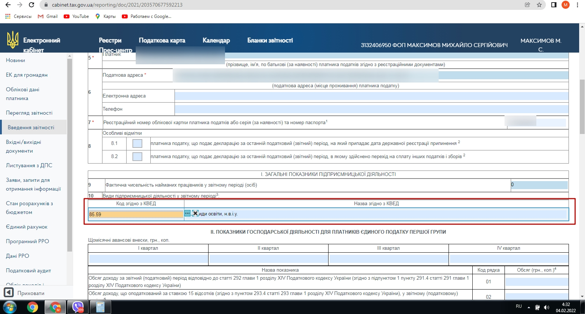
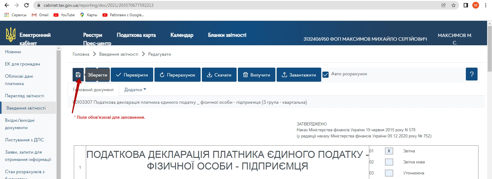

# Відправка звіту
Заходимо до кабінету платника податків https://cabinet.tax.gov.ua/  
До цього вам необхідний електроний цифровий підпис (генерується безкоштовно, за умови наявності рахунку ФОП в ПриватБанку).  
## Заходимо в кабінет і створюємо відовідний звіт (Податкова декларація)
 
 
 
 
 

## Дані щодо обороту беремо в клієнт-банку.
 
 
 
 
 
 
 

 
 
 
 
 
 
 
 
 
 
 
 
 
После отправки отчета обязательно дождитесь "Квитанцию №2" - она подтверждает, что ваш отчет принят.
 

## Для получения реквизитов для оплаты налогов и ЕСВ
 
 
